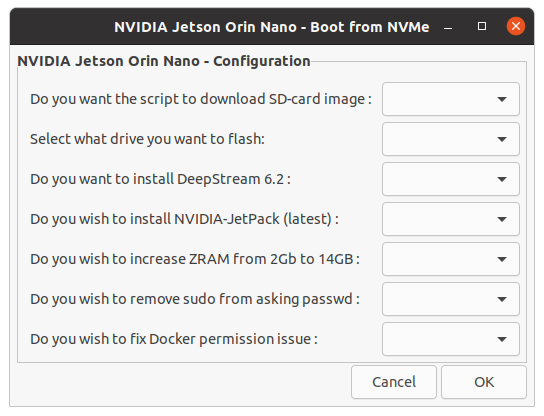
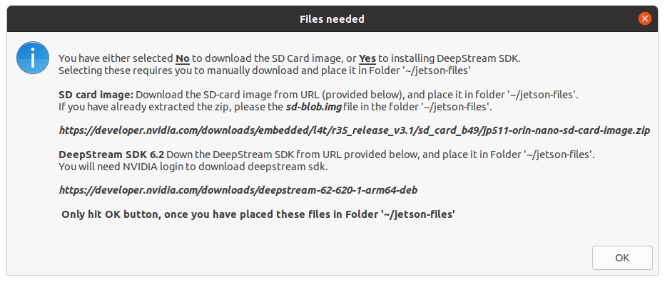
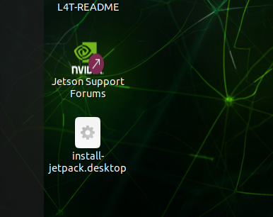

# NVIDIA Jetson Orin Nano - Flash Manager

## Background

NVIDIA Jetson Orin Nano Developer Kit Supports NVMe M.2 SSD. However, it has been proven difficult to flash the NVMe with Ubuntu 20.04 Linux 4 Tegra (L4T) in the same way an SD card can be flashed. 
The official instructions from NVIDIA is to use SDKManager, which only runs on Intel x86 on a Ubuntu 20.04 (best possible verion). SDKManager connectes to the Jetson Orin Nano board on a USB-C cable, however the software doesn't support USB-3.x (for NVMe flashing) making it difficult for many to flash the NVMe and boot from it. From many posts on NVIDIA forum, it is evident that SDKManager needs a very sepecific setup for it to work as designed, otherwise resulting in errors when flashing NVMe.

When i ran into the same issue ([link here](https://forums.developer.nvidia.com/t/jetson-orin-nano-developer-kit-boot-from-nvme/250744/8 "link here")), the support team on the forum were unable to help, so i've diagnosed the issue and found a solution that doesn't require an external Ubuntu machine with SDKManager installed. The solution only requires Jetson Orin Nano, booted using an SD card to flash the NVMe drive ([Forum post here](https://forums.developer.nvidia.com/t/blog-boot-from-nvme-without-using-sdkmanager-or-external-ubuntu-pc-a-solution-that-works/252757 "Forum post here")) with a few manual steps, and doesn't install Jetpack software that SDKManager can do.

So, i've created this git repository to script all aspects of flashing the NVMe drive and helping the user in installing NVIDIA Jetpack and DeepStream package once the board is booted using NVMe. Follow the instructions below to setup your Jetson Orin Nano to boot from NVMe.

## Jetson Orin Nano Supported Accessories NVMe SSDs
All drives are 500GB PCIe Gen3 x4 (other than SABRENT)

|  Drive & features |   Cost |
| ------------ | ------------ |
|  [Crucial P2 3D NAND NVMe PCIe M.2 SSD Up to 2400MB/s](https://amzn.to/42NYh4P "Crucial P2 3D NAND NVMe PCIe M.2 SSD Up to 2400MB/s")  | US$49.95  |
|  [Western Digital WD Blue - Gen3 x4 PCIe 8Gb/s, 3D NAND, Up to 2,400 MB/s](https://amzn.to/3nIOkXz "Western Digital WD Blue - Gen3 x4 PCIe 8Gb/s, 3D NAND, Up to 2,400 MB/s") |  US$40.20 |
|  [SABRENT 500GB Rocket Nvme PCIe 4.0 M.2 2280 (SB-ROCKET-NVMe4-500)](https://amzn.to/42NYIft "SABRENT 500GB Rocket Nvme PCIe 4.0 M.2 2280 (SB-ROCKET-NVMe4-500)") |  US$49.99  |
|NVMe that i'm using |
|[SAMSUNG 980 500GB PCle 3.0x4, NVMe M.2 2280,  3,500MB/s, MZ-V8V500B/AM](https://amzn.to/3VdcNAh "SAMSUNG 980 500GB PCle 3.0x4, NVMe M.2 2280,  3,500MB/s, MZ-V8V500B/AM")|US$39.99|

> Jetson Orin NX supports up to Gen4 PCIe. Jetson Orin Nano supports
up to Gen3 PCIe.

> Note: You can use PCIe Gen4 x4, however you may pay more for the drive and your Jetson Orin Nano will only support Gen3 speeds. So, the recommendation is to get a PCIe Gen3 and save money on a price to performance ratio.

## Using the Script
> Note: This script requires you to download NVIDIA deepstream package from the NVIDIA website. Downloading the package requires you to sign the T&C's, etc., and the package is not distributable. 
> link: https://developer.nvidia.com/downloads/deepstream-62-620-1-arm64-deb 

### Using terminal clone git repo

```bash
cd ~
git clone https://github.com/pawangonnakuti/Jetson-Flash-Manager

```
### Create director ~/jetson-files and save all necessary files
> If you dont want Deepstream installed, you dont need to create the folder, as the script will create it for you.

`~/jetson-files/` folder will be used look for SD-card images and deepstream package files. 
Either you can download the SD-card image file or the script will download it for you.
If you want to install Deepstream, please download the file and place it in this folder.

[](./pictures/jetson-files "jetson-files")

### Run the script

Run the following commands in a terminal,
The script will ask you for a `sudo` password.

```bash
cd ~/Jetson-Flash-Manager
./jondk-flash.sh

```
As the script runs, it first installs the package `pv` that is used throughout to measure progress.

### Configuring your setup

Configuring how you want the script to install.

[](./pictures/jon-script-config.png "Configuration Screen 1")

Select the configuration you want

[](./pictures/jon-script-conf2.png "Configuration Screen 2")

In this configuration, we are saying `No` to downloading the SD-card image, and `Yes` to installing Deepstream and NVIDIA jetpack.
> Script to install NVIDIA jetpack will be available as a Desktop Icon (even if you select `No`)

Click `Yes' to continue.

### Download files confirmation

The pop-up below gives you final confirmation to check all relevant files exists in the folder `~/jetson-files/`
Once your have confirmed, Click `Ok` and the flashing starts. 

[](./pictures/file-needed.png "Files-Needed")

### Sitback, and wait for flashing to complete
Oh! unless you have errors or issues. 
### Rebooting to NVMe

After flashing your NVMe, you will need to reboot Jetson Orin Nano board.
Ensure, you have removed the SDcard prior to the board rebooting.

### Installing NVIDIA jetpack and Deepstream
Once rebooted and logged-in, you will find Install-Jetpack.desktop icon on your Desktop.

[](./pictures/install-jetpack-1.png "Install-Jetpack")

Right-click the Icon, and select `Allow Launching`.

Now, double-click the icon to start installing Jetpack and Deepstream.
The script would ask you to enter your `sudo` password.


